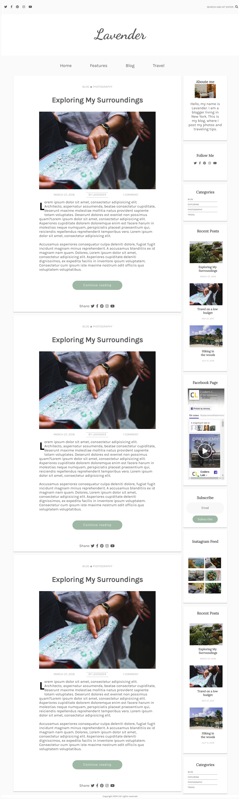

# Blog - template
Simple responsive blog template created with React.js, Sass

## Table of contents
* [General info](#general-info)
* [Technologies](#technologies)
* [Setup](#setup)
## General info
This is my final project at the full-time IT bootcamp - JavaScript Developer: React. My goal was to consolidate the knowledge which I have gained over this two months.
## Technologies
Project is created with:
* React.js
* ECMAScript 6
* CSS3/SASS
* HTML5
## Setup
To run this project, install it locally using npm:

```
$ npm install
$ npm start
```
## Inspiration
http://justfreethemes.com/demo/?theme=Lavander%20Lite